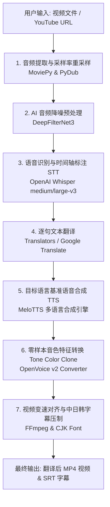

# 🏗️ Video Translator with Voice Cloning & Subtitles 技术架构与实现文档 (implement.md)

本文档系统介绍了 **Video Translator with Voice Cloning & Subtitles** 项目的技术架构、流水线流程、核心技术栈以及版本兼容性设计。

---

## 📐 1. 整体系统架构与处理流水线

本系统接收原始视频输入（本地上传或 YouTube URL），依次通过 **音频提取 -> 降噪处理 -> 语音识别 -> 文本翻译 -> 多语言 TTS 合成 -> 零样本音色克隆 -> 音画同步与字幕压制** 7 个步骤，最终输出带有目标语言音频与中日韩字幕的 MP4 视频。

### 🔄 7 步处理流水线架构图



---

## 🛠️ 2. 核心技术栈与组件分层

整个项目采用了分层解耦的模块化设计，技术栈涵盖了前沿的深度学习音视频处理框架：

| 模块层级 | 核心技术/库 | 功能与作用 |
| :--- | :--- | :--- |
| **交互层 (UI Layer)** | **Gradio (v4/v6)** | 提供 Tabbed Web 交互界面、支持视频上传、YouTube 解析、语言选择及公网 Share 链接。 |
| **视频与音频基础层** | **MoviePy (1.0.3)**<br/>**PyDub**<br/>**FFmpeg-Python** | 视频剪辑、音频通道分离、48kHz 重采样、音频段落拼接与最终视频流渲染。 |
| **AI 音频降噪层** | **DeepFilterNet3**<br/>(`DeepFilterLib` / `df`) | 基于深度学习的端到端音频降噪算法，去除原始视频背景杂音，提升音色提取纯净度。 |
| **语音识别 STT 层** | **OpenAI Whisper**<br/>(`medium` / `large-v3`) | 提供高精度的多语言自动语音识别 (ASR)，精准提取逐句时间戳 (Timestamps)。 |
| **文本翻译层** | **Translators API** | 自动化批量句子翻译，支持英语、中文、日语、韩语、法语、西班牙语等多语言互译。 |
| **多语言 TTS 合成层** | **MeloTTS**<br/>(`MeCab`, `unidic`, `fugashi`, `g2pkk`, `jamo`) | 高清文本转语音合成引擎，内部集成中、英、日、韩等多语言分词器与发音词库。 |
| **零样本音色克隆层** | **OpenVoice v2** | 提取原说话人的 Speaker Vector（音色特征），将其注入到 TTS 合成的音频中，完美还原原说话人声音。 |
| **中日韩字幕压制层** | **FFmpeg Subtitles Filter**<br/>(`Noto Sans CJK SC` / `WenQuanYi`) | 集成 Linux / Windows CJK 中文字体库支持，解决字幕硬压制出现的 `□□□` 乱码方块问题。 |

---

## ⚡ 3. 架构难点与版本兼容性设计 (Compatibility Engineering)

项目在兼容最新 Python 生态（Python 3.13 / PyTorch 2.6+ / 新版 torchaudio）时，设计并融入了以下 4 项核心兼容补丁：

### 1️⃣ PyTorch 2.6+ 权重加载兼容补丁
* **背景**：PyTorch 2.6+ 默认修改了 `torch.load()` 的安全策略，默认 `weights_only=True` 导致 OpenVoice 的 `.pth` 权重文件报错 `UnpicklingError`。
* **解决**：在 [app.py](file:///d:/CSharp/Video-Translator-with-Voice-Cloning-and-Subtitles/app.py) 顶部注入猴子补丁，自动为模型加载设为 `weights_only=False`。

### 2️⃣ torchaudio 最新版架构与路径映射补丁
* **背景**：新版 `torchaudio` 移除了 `torchaudio.backend.common` 模块和 `torchaudio.info()` 方法，导致 `deepfilternet` 崩溃。
* **解决**：动态构建虚拟 `torchaudio.backend` 模块，并利用标准 `soundfile.info` 实现了 `torchaudio.info` 的无缝替代。

### 3️⃣ FFmpeg 中日韩字幕压制乱码解决
* **背景**：Linux (Ubuntu / Colab) 系统默认缺乏中文字体，压制字幕会出现 `□□□` 豆腐块。
* **解决**：在系统中集成 `fonts-noto-cjk` 字体库，并在 FFmpeg `subtitles` 过滤器中强制指定 `Fontname=Noto Sans CJK SC`。

### 4️⃣ 依赖死锁避让与解耦
* **背景**：`MeloTTS` 远程仓库的 `setup.py` 硬编码限制了旧版 `mecab-python3==1.0.9`，在 Python 3.13 下会导致源码编译卡死。
* **解决**：松绑 [setup.py](file:///d:/CSharp/Video-Translator-with-Voice-Cloning-and-Subtitles/setup.py) 与 [requirements.txt](file:///d:/CSharp/Video-Translator-with-Voice-Cloning-and-Subtitles/requirements.txt) 中的死锁版本，使用 `--no-deps` 挂载 `MeloTTS`，直接复用现代编译好的 wheel 二进制包。

---

## 📁 4. 关键目录与文件功能

```
Video-Translator-with-Voice-Cloning-and-Subtitles/
├── app.py                      # 系统主入口、Gradio 路由、流水线调度与兼容补丁
├── setup.py                    # 项目打包与依赖配置文件
├── requirements.txt            # 洗净后的全量 Python 依赖清单
├── README.md                   # Colab 部署与本地 3060 Ti 运行快速指南
├── implement.md                # 架构设计与技术实现文档 (本文件)
├── .gitignore                  # Git 提交忽略规则 (过滤输出 MP4/WAV/缓存)
├── openvoice/                  # OpenVoice v2 模型架构、转换器与特征提取器
│   ├── api.py                  # ToneColorConverter 核心类实现
│   └── se_extractor.py         # 说话人音色向量提取模块
└── checkpoints_v2/             # 模型预训练权重目录 (Git LFS 管理)
    ├── converter/              # 音色转换器检查点 checkpoint.pth
    └── base_speakers/ses/      # 各语言基准 Speaker 向量
```

---

## 🚀 5. 环境快速验证命令

```bash
# 验证 PyTorch CUDA 硬件加速
python -c "import torch; print('CUDA Status:', torch.cuda.is_available()); print('Device Name:', torch.cuda.get_device_name(0))"

# 启动本地交互界面
python app.py
```
